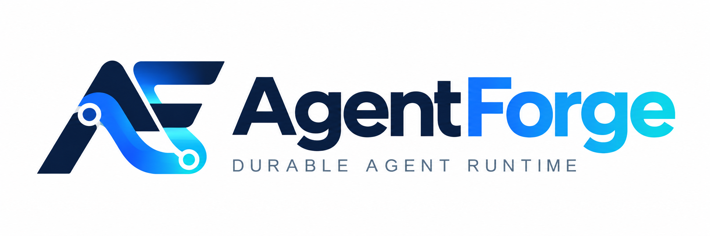
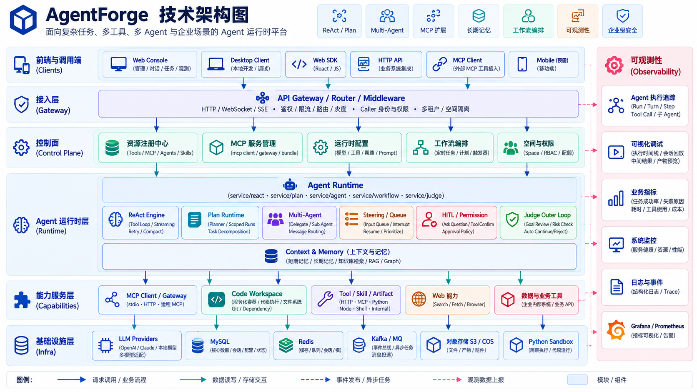
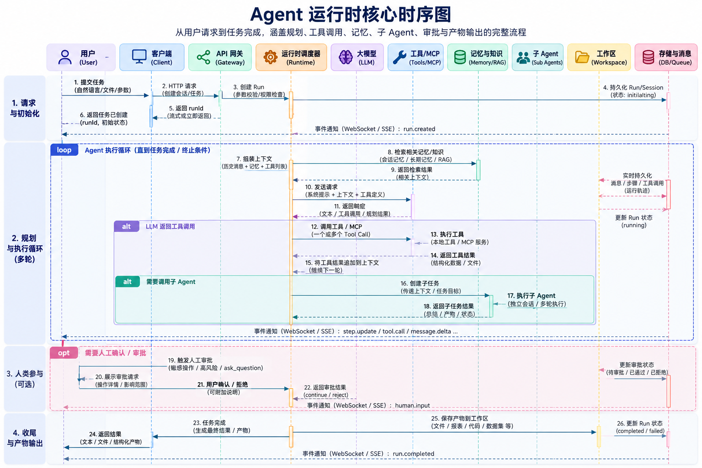

<p align="center">
  
</p>

<h3 align="center">可直接调用的 ReAct / Plan 双范式 Agent 基座服务</h3>

<p align="center">
  
  
  
  
  
  
  
</p>

---

**react-base-service** 是一个开箱即用的通用 Agent 基座服务：内置 ReAct 与 Plan 两种执行范式，以及一个 Agent 服务所需的完整周边能力——会话管理、历史回放、异步任务、定时工作流、工具产物、轮次反馈、附件、长期记忆、多 Agent 委派、HITL 人机协同。注册好模型、工具与提示词，即可通过一个 WebSocket 入口获得完整的智能体运行时。

## ✨ 核心特性

- 🔁 **ReAct 运行时** — WebSocket 单入口 `/react-base-service/react/ws`：模型流式输出 + 工具循环 + 上下文自动压缩 + 模型互备
- 📋 **Plan 模式** — 结构化 Planner 生成线性计划（全量持久化），逐步创建隔离 Scoped Run 执行，USER_INPUT / USER_ACTION 步骤持久化等待，支持 resume / retry / skip / cancel
- 🤝 **多 Agent 委派** — Agent 注册表（支持 Markdown 导入），`delegate_agent` 委派子 ReactRun：父子历史与 token 预算隔离、事件按 agentPath 归流、支持同轮并行委派
- 🧰 **两段式工具加载** — 模型只看工具摘要索引，`get_tool` 按需激活完整定义、`execute_tool` 校验执行；Business Tool 支持 http / client / mcp 三类，MCP 客户端支持静态声明 + 动态登记
- 🧠 **双层记忆** — 跨会话长期记忆（owner 作用域、分层注入、修订审计）+ Graphiti 时序事实图谱
- 👤 **HITL 人机协同** — 浏览器执行 Client Tool、ask_question 补充信息、危险工具二次确认
- 🧪 **沙箱与产物** — python_exec 沙箱执行 + 对象存储产物下载（自部署 MinIO / 腾讯 COS / 本地目录三种后端），csv / md / txt 附件上传与引用
- 📦 **Bundle 插件包** — manifest + agents + skills + .mcp.json 打包安装，快照式卸载回滚
- ⏰ **定时触发工作流** — cron 无人值守调度 ReAct run：裁判外环语义判级 + 未达成自动追问续跑、markdown 报告产物化、连环失败熔断、webhook 通知，配管理面板

## 🏗️ 系统架构

<p align="center">
  
</p>

五层结构：客户端（Web SDK 多会话 UI / playground · replay 宿主页 / 业务 Caller）→ router + 免鉴权中间件（信任 X-User-Name 头，缺省 anonymous；HTTP 管理面 + WebSocket 运行入口）→ 控制器 → service 层（ReAct / Plan 双运行时 + Steering 引导与排队 + 双层记忆 + cron 定时工作流 + 工具 / Agent / Skill / Bundle / Caller / 模型配置等注册类资源管理）→ 基础设施（LLM 网关 / MySQL / Redis / 对象存储 MinIO · COS · 本地目录 / Python 沙箱 / Graphiti 时序图谱）。

- 详细分层与设计约束见 [系统架构](docs/architecture.md)

## 🔄 ReAct 运行时

<p align="center">
  
</p>

一次 run 的完整生命周期：**装配**（caller 路由与模型解析 / failover、系统提示词前缀拼接、工具摘要索引、Skill 索引、长期记忆分层注入）→ **单事务启动**（行锁复用或创建 session 并校验归属五元组；命中活跃 run 转 Steering 引导 / 排队；全量历史装配含 compact 覆盖过滤与孤儿 tool_use 回填；继承上一轮 TodoState 与已激活工具；用户消息落库并建 run）→ **主循环**（每轮模型调用前做上下文治理——微压缩与超阈值全量压缩按工具轮次边界对齐；模型流式轮 → 解析 tool call → 危险操作确认 / HITL 作答 → 串行执行 → 结果回填；步边界消费运行中引导；`delegate_agent` 委派子 run 同轮并行）→ **finish 收敛**（无工具调用即终态落库，触发排队输入自动续跑晋升）。


## 🚀 快速开始

**方式一：Docker Compose 一键起**（推荐试用）

```bash
# 1. 填入 LLM API key
vim deploy/compose/conf/mount/api.yaml

# 2. 一键起全套（MySQL 建库 + Redis + python 沙箱 + 服务）
docker compose up -d --build

# 3. 访问 playground
open http://127.0.0.1:8080/react-base-service/react/playground
```

**方式二：日常开发（依赖容器化 + 服务本地直跑）**

改代码不需要重新打包镜像——依赖在容器里，前后端本地 `go run` 直跑（web 前端是 embed 静态资源，无独立构建步骤）：

```bash
# 依赖容器（一次性）：MySQL / Redis / python 沙箱
# 注意：基础 compose 里 python 沙箱只挂 internal 隔离网络、不发布宿主机端口（P0-1 网络硬隔离），
# 本机 go run 需要直连，故叠加 docker-compose.dev.yml 覆盖层把 18190 端口放出来。
docker compose -f docker-compose.yml -f docker-compose.dev.yml up -d mysql redis sandbox

# 本地起服务（前台，监听 :8180；改代码后重跑即生效）
go run main.go

# 或直接用脚本：./dev.sh（已默认带上 dev 覆盖层）| ./dev.sh deps | ./dev.sh stop
```

本地开发约束：

- **依赖只在容器中跑**：MySQL=`127.0.0.1:3317`、Redis=`127.0.0.1:16379`、Python 沙箱=`127.0.0.1:18190`，宿主机端口由仓库根 `.env` 固化
- **沙箱端口来自 dev 覆盖层**：`18190` 只在 `docker-compose.dev.yml` 生效；发布形态（`docker compose up -d --build`，不含覆盖层）沙箱不对外发布端口、且不可出网。**不要把覆盖层带到发布环境**
- **本地服务端口 8180**（`conf/mount/config.yaml` 的 `server.address`），与容器版 service（:8080）可并行
- **不要用 `docker compose up -d --build service` 验证代码改动**——那是发布形态；日常开发一律本地 `go run`
- DB 注册的 MCP 连接本地与容器共用同一注册表，本地启动时自动拉起

**方式三：本机分步运行（不依赖容器）**

```bash
# 1. 建库（MySQL）
mysql -h <host> -u root -p < sql/init.sql

# 2. 配置（编辑 conf/mount 下的四个 yaml，替换占位符）
vim conf/mount/resource.yaml   # MySQL / Redis / COS
vim conf/mount/api.yaml        # LLM 网关 / python-exec 沙箱
vim conf/mount/custom.yaml     # 模型目录、ReAct 运行时

# 3. 构建前端 SDK（playground 页面依赖；不构建则仅 SDK 路由 404）
cd web/sdk && npm i && npm run build && cd ../..

# 4. 启动本地 python 沙箱（可选；不启动则 python_exec 工具不可用）
cd sandbox && SANDBOX_HOST=127.0.0.1 python server.py && cd ..   # 监听 :8190

# 5. 启动
go run main.go                 # 监听 :8180（conf/mount/config.yaml 可改）
```

**运维端点**：`/healthz`（存活）、`/readyz`（就绪，探测 MySQL/Redis）、`/metrics`（Prometheus 指标：run 数 / 模型耗时 / 工具失败率 / WS 连接数等）；日志默认落 `log/` 目录并按大小轮转。

## 💻 使用 SDK 接入

前端通过 TypeScript SDK（`@react-agent-web-sdk`，内置 SolidJS UI 组件）接入：

```typescript
import { createAgentClient, mountAgentUI } from '@react-agent-web-sdk';

const agent = createAgentClient({
  baseUrl: 'http://localhost:8080',
  callerKey: 'my-app',
  routeValues: ['demo'],
});

const ui = mountAgentUI(document.getElementById('agent-container'), agent, {
  title: 'AI Assistant',
  theme: 'dark',
});
```

详见 [web/sdk/README.md](web/sdk/README.md) 与 [接入指南](docs/integration-guide.md)。

## 🧰 技术栈

| 层 | 选型 |
|---|---|
| 语言 | Go 1.25 |
| Web 框架 | Gin · 手写 WebSocket（RFC 6455 握手 / 帧编解码 / ping-pong 保活） |
| 存储 | GORM + MySQL 8（sql/init.sql 全量建库）· redigo + Redis 7 |
| LLM 接入 | claude / gpt 兼容 / minimax，流式输出 + 工具调用，模型互备 |
| 工具协议 | MCP（modelcontextprotocol/go-sdk）客户端 |
| 校验 | jsonschema-go（工具输入 Schema 校验） |
| 可观测 | Prometheus `/metrics` · 日志按大小轮转（lumberjack） |
| 沙箱 | Python 3.11（python_exec：pandas / numpy / matplotlib） |
| 前端 | embed 静态页面（playground / replay / workflow-admin）· TypeScript SDK（SolidJS UI） |
| 部署 | Docker Compose（服务 + 依赖 + Prometheus / Loki / Grafana 监控全家桶） |

## 📁 目录结构

```
├── main.go                  # 入口：PreInit → InitResource → 路由 → 后台任务 → HTTP
├── router/                  # 路由注册（react / 注册类管理接口 / 静态资源）
├── controllers/http/        # HTTP/WS 控制器（react、attachment、caller、agent、skill、tool、apikey、systemprompt、llmmodel、setting、workflow、probe）
├── service/react/           # ReAct 运行时核心（引擎、运行时装配、Meta Tool、委派、记忆注入、会话历史、异步任务…）
├── service/                 # 领域服务：tool / skill / agent / memory / graphmemory / workspace / mcpclient / bundle / asynctask / workflow / judge / plan / caller / apikey / systemprompt / llmmodel / token / skillchatfile
├── api/llm/                 # LLM 客户端（claude / gpt 兼容 / minimax，流式+工具调用）
├── api/pythonexec/          # python_exec 沙箱客户端
├── models/llm/              # GORM 模型（38 张表，表结构见 sql/init.sql）
├── components/              # 错误码、响应渲染、参数结构、路由前缀、COS、调用方运行时上下文
├── conf/                    # 配置加载 + conf/mount 示例配置（脱敏）
├── middleware/              # 免鉴权中间件（信任 X-User-Name 头，缺省 anonymous）
├── web/                     # playground / replay 页面 + TypeScript SDK（embed 进二进制）
├── sql/init.sql             # 全量建库脚本
└── docs/                    # 受管文档体系（system / changelog / plan）+ 架构、接入、部署与专题文档
```

## 🧪 测试与 CI

```bash
go test ./... -count=1                # Go 单测（CI 默认执行）
go test -tags integration ./router/... ./service/...   # 集成测试（需真实 MySQL）
cd web/sdk && npm run test:run        # SDK 单测
```

CI（[.github/workflows/ci.yml](.github/workflows/ci.yml)）：push / PR 触发 Build + Vet + Test（Go 与 SDK 两个 job），集成测试 job 需手动触发（起 MySQL service 容器）。

## 📚 文档

- [文档总索引](docs/README.md) — 含 `docs/system/` 全量模块系统文档与 `docs/changelog/` 变更记录
- 专题：[系统架构](docs/architecture.md) · [接入指南](docs/integration-guide.md) · [启动与部署](docs/deployment.md) · [Runtime 模块化](docs/runtime-modularization.md) · [MCP 客户端与仓库检索能力边界](docs/mcp.md) · [多 Agent 编排](docs/multi-agent-orchestration.md) · [定时触发工作流](docs/定时触发工作流实现方案.md) · [Memory 专题](docs/memory.md)
- 内置页面：playground 联调页（`/react/playground`）、历史回放页（`/react/replay`）、工作流管理面板（`/react/workflow/admin`）、MCP 连接管理

## 🧭 能力总览

| 能力 | 说明 |
|---|---|
| ReAct 运行时 | WebSocket 单入口 `/react-base-service/react/ws`，模型流式输出 + 工具循环 + 上下文自动压缩 + 模型互备 |
| 多 Agent 委派 | Agent 注册表（`/agent/*`，支持 Markdown 导入）；`delegate_agent` 委派子 ReactRun 执行：父子历史/token 预算隔离、事件按 agentPath 归流、支持同轮并行委派 |
| 计划确认 | `create_plan` Meta Tool：复杂任务先提交分步计划，前端计划卡片 + 「开始任务」确认后按计划执行（进度走 todo）；caller 级三态开关 `allow_plan`（未设置跟随全局 `llm.react.allow_plan`，caller 可强制开/关），显式 Plan 模式入口同闸门 |
| Plan 模式 | `executionMode=plan` 的独立执行范式：结构化 Planner 生成线性计划（6 张表全量持久化），逐步创建隔离 Scoped ReactRun 执行，USER_INPUT/USER_ACTION 步骤持久化等待，WS/HTTP 双通道 resume、retry、skip、cancel；Finalizer 总结写回会话历史，等待期间不依赖原 goroutine（详见 [Plan 模块文档](docs/system/plan.md)） |
| 会话管理 | 会话隐式创建/复用（事务加锁 + 归属校验）、会话列表、并发 run 互斥、软删状态；启动期自动清理重启残留的陈旧活跃 run；会话分叉（fork）：截断点前历史按 run 边界单事务复制成新会话，消息级 / run 级截断点二选一（`throughRunId` + `inclusive`），活跃 run 拒绝；会话重命名（仅标题元数据，活跃 run 不拦截） |
| 历史回放 | 持久化消息还原为与实时协议同形的事件流（`/react/session/events`），内置回放页面 `/react/replay` |
| 工具体系 | Business Tool 注册（http/client/mcp 三类）、两段式加载、输入 Schema 校验、白名单、异步提交型工具；MCP 客户端双来源：`custom.yaml` `mcp` 段静态声明 + 「MCP 连接管理」接口动态登记（`tblLlmMcpServer`，支持粘贴 mcpServers JSON、请求头透传、连接测试、启停与工具清单同步），工具自动进注册表供 ReAct 运行时使用 |
| Skill 体系 | Skill 注册 + 摘要索引注入 system 前缀 + get_skill 按需加载完整说明；支持 `default` 默认作用域 |
| 长期记忆 | 跨会话记忆按 owner 作用域读写（memory_write 等 Meta Tool）、run 启动分层注入、修订审计与回滚；管理面 `/react/memory/*` |
| 图谱记忆 | Graphiti 时序事实图谱（Layer2）：run 启动事实注入 + `graph_memory_search` / `graph_memory_write` Meta Tool，外部 REST 存储 |
| 代码工作区 | git worktree 代码工作区：bare mirror 单副本缓存 + 静态解析 + commit 锁定，(service, commit) 粒度引用计数共享——多 run / 多 caller 复用同一 worktree 与 repo MCP 子进程；挂载只读检索工具（`ws_<service>_<commit8>_*`）；运行视图 `/react/workspace/active` |
| Bundle 插件包 | manifest + agents + skills + .mcp.json 打包安装，展开写入注册表并记录快照，卸载按快照逆序回滚（`/react/bundle/*`） |
| HITL 交互 | Client Tool（浏览器执行）、ask_question 补充信息、危险工具二次确认（tool_confirm），统一经 clientMessageHub 按 toolUseId 认领回包 |
| 系统提示词 | 按 callerKey + routeValues 前缀匹配解析，多条由通用到具体拼接；支持 `default` 默认作用域（全 caller 共享，拼接在最前） |
| 异步任务 | 提交快照落库、`<async_tasks>` 提醒注入、resolve/get 闭环工具、Provider 状态同步框架（可插拔） |
| 定时触发工作流 | cron 无人值守调度 ReAct run（`llm.workflow.enabled` 总开关，`/react/workflow/*` 管理接口）：占位符渲染提示词 + headless 执行、裁判外环语义判级 + 未达成自动追问续跑、markdown 报告产物化（通知附下载链接）、连环失败熔断、webhook 通知（企业微信/飞书）、管理面板 `/react/workflow/admin`（详见 [定时触发工作流实现方案](docs/定时触发工作流实现方案.md)） |
| 产物与附件 | python_exec 沙箱执行 + 对象存储产物下载（provider 可选 minio/cos/local）；csv/md/txt 附件上传与引用 |
| 轮次反馈 | run 级点赞/点踩与问题反馈，会话维度回显 |
| 模型管理 | 用户自定义模型（modelHash 直引）、模型白名单 |
| 默认作用域 | 工具/系统提示词/skill 可挂在保留伪 caller `default` 下，全部 caller 的请求自动合并解析；管理面板三类资源支持 全部/默认/各 caller（按平台分组）筛选，新建跟随筛选落到目标作用域 |
| 内置页面 | playground 联调页（`/react/playground`）、回放页（`/react/replay`）、工作流管理面板（`/react/workflow/admin`）、TypeScript SDK |

## 🗺️ 范围与边界

- **只做通用 Agent 基座**：提供与业务域解耦的运行时和注册管理接口。通用执行范式（ReAct、Plan）属于基座；业务知识库检索、具体业务流程编排等上层能力不属于。`create_plan` 仅为 ReAct 模式内的计划确认卡片，与 Plan 模式互不影响。
- **对外契约保持稳定**：ReAct 引擎主循环、系统提示词装配顺序（systemPrompt + 工具索引摘要 + Skill 索引摘要）、Meta Tool 集合与描述、两段式工具加载与指纹自愈、Skill 注入，以及注册类接口（caller/skill/tool/apikey/system-prompt）的请求响应结构。
- **通用化设计**：HTTP 工具请求头透传不绑定特定 caller；异步任务 Provider 框架默认无内置 Provider，按需注册扩展。

## 📄 License

本项目暂未附加开源协议（License），默认保留所有权利；引用代码请注明出处。
