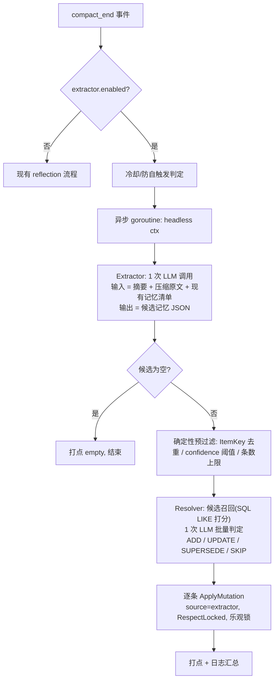

# 长期记忆 V2 实施计划（Phase 1–2）

- 日期：2026-09-25
- 关联设计：《[长期记忆优化.md](./长期记忆优化.md)》（Agent Long-Term Memory V2 设计方案，本计划只覆盖其 §14 中的 Phase 1 与 Phase 2）
- 现状文档：`docs/system/memory.md`、`docs/memory.md`
- 状态：待评审

---

# 1. 范围与目标

本期把 Memory 从"长期事实存储"推进为"类型化的、可自动沉淀的认知记忆"，共两步：

| 阶段 | 目标 | 一句话 |
|---|---|---|
| Phase 1 | 记忆类型化 + Preference Memory | 存量表加 `memory_type / confidence / importance` 三列，打通"用户偏好"这一高价值类型的专用渲染与读写链路 |
| Phase 2 | Memory Extractor + Memory Resolver | compact_end 后自动从对话中抽取候选记忆，与存量记忆做冲突消解后经统一写核心落库，实现自动沉淀 |

**明确不做**（属 Phase 3+，见 §9）：embedding/向量检索、图记忆、Memory Entity 新表（`tblLlmMemoryEntity`/`tblLlmPreference`）、memory_confirm、Session/Checkpoint 对齐。

---

# 2. 参考项目借鉴与取舍

本地参考仓库均在上级目录（`C:\Users\keke\Desktop\xm\`）：

| 来源 | 借鉴点 | 落到本计划的哪里 | 明确不抄的部分 |
|---|---|---|---|
| **mem0**（`mem0/configs/prompts.py`、`mem0/memory/main.py`） | 两段式流水线：先一次 LLM 抽 facts，再带"已有记忆清单"做单次 LLM 判定 ADD/UPDATE/DELETE/NONE；输出用顺序编号防幻觉 ID；fact 抽取纪律（上下文自包含、保留具体细节、绝对日期、不记一次性任务、用户语言） | Phase 2 Extractor/Resolver 的 prompt 与流程骨架 | V3 的实体链接/BM25 混合检索/向量库（Phase 3）；DELETE 决策（本期 Resolver 不提供删除，降低错杀风险） |
| **Graphiti**（`graphiti_core/utils/maintenance/edge_operations.py`、`prompts/dedupe_edges.py`） | 矛盾判定（LLM 只输出 idx）与失效执行（确定性逻辑）分离；"失效 = 更新而非删除"，历史经快照回溯；"数字/日期/限定词有差异的不得判为重复" | Resolver 的 SUPERSEDE 语义：旧内容进 revision 快照，不物理删除 | bi-temporal 四时间戳字段（现有 created_at/updated_at + revision 流水已够用） |
| **Letta / letta-code**（`src/agent/memory.ts`、`system-prompt-compilation.ts`） | core memory（常驻全文）与 external（只给索引）的渲染分层；写操作必填 reason（本仓已有）；description 是检索/相关性的第一入口 | Phase 1 的 `<memory>` 块分节渲染沿用其"常驻节 + 索引节"模式 | MemFS/git 文件记忆（架构方向不同） |
| **ZCode**（`apps/zcode-cli/packages/core/src/memory/`） | 记忆类型标签体系（user/feedback/project/reference）+ 每类的 when_to_save / what NOT to save 教学；后台 extraction subagent 的触发-冷却-跳过条件；"先验证再使用记忆"纪律 | Phase 2 Extractor prompt 的类型定义与跳过条件；Phase 1 类型常量命名 | 单事实文件 + MEMORY.md 索引（本仓是表结构） |

---

# 3. 现状基线与实施硬约束

现状（V1）关键事实，实现时不可破坏：

1. **唯一写入口**：一切写操作必须经 `service/memory.ApplyMutation`（`service/memory/memory.go:148`），管理面/引擎工具/reflection 共享校验、幂等收敛、乐观锁、修订流水、敏感拦截。新模块一律构造 `MutationInput` 走它，不旁路落库。
2. **表结构**：`tblLlmMemoryItem` 逻辑唯一键 `(owner_type, owner_key, item_key)`；`item_key` 是 content 规范化 SHA-256 前 16 位（`service/memory/memory.go:64`）。**新字段不得混入 ItemKey 计算**，否则幂等口径漂移。`tblLlmMemoryRevision` 不可变只插，`before_json/after_json` 是整条 `MemoryItem` 的 JSON 快照——加字段后快照自动携带，回滚自动兼容（旧快照缺字段需补默认值，见 4.1-T4）。
3. **分层**：resident/detached 是同表 `layer` 列；resident 全文注入（`ResidentBudgetChars` 预算截断），detached 只注入目录、正文靠模型调 `memory_read`。渲染在 `service/memory/runtime.go` 的 `RenderRuntimeContext`，构建在 `BuildRuntimeContext`。
4. **作用域**：`(OwnerType, OwnerKey)` 确定记忆空间；`allow_user_scope=true` 时 caller_user 是高优先级覆盖层兼默认写入目标。合并规则在 `MergeRuntimeItems`。**OR 作用域条件的坑**：state 条件必须并入每个 OR 分支（`models/llm/memory.go:91`），`memory_sql_test.go` 有 DryRun 防回归断言，改查询必须同步。
5. **工具体系**：memory_list/read/write 是内置 Meta Tool（`service/react/meta_tools.go` 常量与分发，`service/react/memory.go:59-116` schema）。新增工具或入参需同步：常量/isInternalMetaTool、定义注册、`ExecutionProfile` 字段 + `allowsInternalTool` switch。reflection 的受限 Profile（仅 AllowMemory）会自动屏蔽未放行工具。
6. **reflection 现状**：仅 compact_end 触发（`service/react/runtime_support.go:310` 附近，`maybeTriggerMemoryReflection`），进程内冷却表、防自触发、异步 goroutine、headless gin context（必须 `helpers.SetUserName`）、失败静默重试一次。prompt 五阶段，写入限额 `Reflection.MaxWritesPerRun`，`RespectLocked=true`。
7. **无 embedding**：本仓没有任何向量/语义检索；detached 无"按输入相关性检索"。Phase 2 的相似记忆召回只能基于 SQL LIKE + 内存打分，**这是本期已知的能力上限**（Phase 3 换成向量检索时只替换 Resolver 的候选召回函数）。
8. **约定**：分层 router → controllers/http/<模块> → components/params → service/<模块> → models/llm；ORM tag 必须显式 `column:` 且与 DDL 注释、rune 长度常量成对维护；`conf/config.go` 新配置用指针 + 零值检查 + normalize 段填默认值，**新开关默认关闭（灰度语义）**；受管文档 `docs/system/memory.md` 需同步并写 changelog。
9. **存量环境 SQL**：`sql/init.sql` 注释明示存量环境只跑 CREATE IF NOT EXISTS——**加列必须另写 ALTER 增量脚本**（新建 `sql/memory_v2_upgrade.sql`）。
10. **LLM 直连方式**：引擎用 `llm.GetClientWithUserModel(req.apiKey, currentModel.ModelKey)`（`service/react/engine.go:73`）。Phase 2 extractor 不起 ReAct 子 run，直接复用该方式拿 `llm.LLMClient`，model 参数与引擎现有 `ChatStreamWithTools` 用法保持一致；流式收集仿照 engine.go 的 `collectLLMStreamResult`。

---

# 4. Phase 1：记忆类型化与 Preference Memory

## 4.1 数据模型变更

### T1. 建表增量脚本 `sql/memory_v2_upgrade.sql`（新建）

```sql
-- 长期记忆 V2 Phase 1：类型化字段（存量环境执行一次；幂等性人工保证，
-- 重复执行会报 Duplicate column，可先查 information_schema 再执行）
ALTER TABLE `tblLlmMemoryItem`
    ADD COLUMN `memory_type` VARCHAR(16) NOT NULL DEFAULT 'fact'
        COMMENT '记忆类型: preference=用户偏好/fact=事实/event=事件/procedure=经验方法' AFTER `layer`,
    ADD COLUMN `confidence` DECIMAL(4,3) NOT NULL DEFAULT 0.800
        COMMENT '可信度 0-1，模型/管理面写入默认 0.80，extractor 按抽取置信度写入' AFTER `memory_type`,
    ADD COLUMN `importance` TINYINT UNSIGNED NOT NULL DEFAULT 3
        COMMENT '重要程度 1-5，注入排序用（高优先）' AFTER `confidence`,
    ADD INDEX `idx_owner_mtype_state` (`owner_type`, `owner_key`, `memory_type`, `state`);

-- 存量数据回填：DEFAULT 'fact' 已覆盖，无需 UPDATE。
-- 同步更新 sql/init.sql 中 tblLlmMemoryItem 的 DDL（新库直接建出全量结构）。
```

要点：
- 不建新表。V2 设计文档 §4 的 `tblLlmMemoryEntity`/`tblLlmPreference` 推迟到 Phase 3 评估——当前单表 + 类型列足以支撑四类记忆，且避免双写/迁移成本。
- `uk_owner_item` 唯一键不变；同一内容不同类型会收敛为同一条目（内容相同即事实相同，可接受）。

### T2. 结构体与常量（`models/llm/memory.go`）

```go
const (
    MemoryTypePreference = "preference"
    MemoryTypeFact       = "fact"
    MemoryTypeEvent      = "event"
    MemoryTypeProcedure  = "procedure"

    MemoryImportanceMin = 1
    MemoryImportanceMax = 5
    MemoryConfidenceDefault = 0.80
)

// MemoryItem 增加三个字段（显式 gorm tag，与 DDL 成对）：
MemoryType string    `json:"memoryType" gorm:"column:memory_type;not null;default:'fact'"`
Confidence float64   `json:"confidence" gorm:"column:confidence;not null;default:0.8"`
Importance int       `json:"importance" gorm:"column:importance;not null;default:3"`
```

- 新增 `IsValidMemoryType(string) bool`、`NormalizeMemoryType`（空/非法 → fact）、`NormalizeConfidence`（<0.05 或 >1 → 默认 0.80；extractor 传入合法值原样保留）、`NormalizeImportance`（越界 clamp 到 [1,5]）。
- `MemoryItemFilter` 增加 `MemoryType string` 过滤，`FindMemoryItemsByFilter` 相应加条件。
- 新增 DAO：`FindActiveMemoryItemsByOwnerAndType`（单 owner + 可选 type，供渲染与 Resolver 候选召回复用）。

### T3. 写核心扩展（`service/memory/memory.go`）

- `MutationInput` 增加 `MemoryType / Confidence / Importance` 三个字段（0 值语义 = 未指定，落默认）。
- `applyMutation` 归一化段调用 T2 的 Normalize 系列；`ValidatePayload` 增加 memory_type 白名单校验。
- `mutateCreate` / `mutateUpdate` 把字段写入 item；**ItemKey 计算不变**。
- `snapshotJSON` 无需改动（整 struct Marshal 自动携带）。
- **回滚兼容**：`RollbackRevision` 反序列化旧快照后，`memory_type` 为空 → `fact`、`confidence` ≤0 → 0.80、`importance` ≤0 → 3，再落库（旧快照是 Phase 1 之前生成的，没有这三个字段）。

### T4. 单测同步（`models/llm/memory_sql_test.go` + 新增 `service/memory` 用例）

- DryRun 断言：type 过滤查询、新索引命中、OR 条件 state 不回归。
- ApplyMutation：memory_type 非法拒绝、confidence/importance 归一化、create 幂等不受类型影响。
- 回滚：旧格式快照（无三字段）回滚成功且补默认值。

## 4.2 工具与注入

### T5. memory_write 工具增加 `memoryType` 入参（`service/react/memory.go`）

```go
"memoryType": map[string]interface{}{
    "type": "string",
    "enum": []string{"preference", "fact", "event", "procedure"},
    "description": "记忆类型，默认 fact。preference 仅用于用户稳定偏好（称呼、语言、输出格式偏好），需用户明确表达过；event 用于带时间的关键决定/经历；procedure 用于沉淀的工作方法。拿不准就用 fact。",
},
```

- **模型工具不暴露 confidence/importance**（避免模型乱填；由 extractor/管理面维护），schema 的 required 不变。
- `executeMemoryWrite` 把 memoryType 透传进 `MutationInput`。
- `memory_list` 增加 `type` 过滤参数；`memoryListItemView` 增加 `memoryType` 字段；目录行对非 fact 类型加类型前缀（如 `- #12 [preference] 称呼 — ...`），fact 保持原样（向后兼容，目录噪声最小化）。

### T6. `<memory>` 块分节渲染（`service/memory/runtime.go` `RenderRuntimeContext`）

目标结构（Preference Memory 的落地核心）：

```
<memory>
## 用户偏好
- 用户希望回答先总结后展开（confidence 0.9）
## 常驻记忆
- [标题] 正文 …（现状 resident 全文节）
## 记忆目录
- #12 [event] 标题 — 描述 …（现状 detached 索引节）
（记忆使用纪律说明，保留）
```

规则：
1. preference 类型条目（**不论 resident/detached**）全文注入"用户偏好"节，排序 `importance DESC, updated_at DESC`；该节与 resident 共用 `ResidentBudgetChars` 预算，偏好节优先占预算。
2. 已全文注入的 preference 条目从 detached 目录中排除（避免双重展示）；detached 的 preference 若因预算被挤出，回退为目录条目。
3. resident 节排除 preference 类型（已上移）。
4. 类型化渲染失败的兜底：任何异常保持 V1 渲染（整体 return 旧逻辑），不阻断 run。

### T7. 管理面（`controllers/http/react/memory.go` + `service/react` 视图）

- create/update 请求体与 `memoryAdminItemView` 增加 `memoryType / confidence / importance`；list 支持 `memoryType` 过滤。
- 校验复用 T3 的归一化函数。

## 4.3 配置、指标、文档

- **配置**：Phase 1 无新增开关（memory.enabled 已门控）。唯一行为变化是渲染分节，随 enabled 灰度。
- **指标**：`MemoryItems{owner_type, layer}` gauge 增加按 `memory_type` 的维度（新 gauge `MemoryItemsByType{owner_type, memory_type}`，避免动老 gauge 的基数契约）。
- **文档**：更新 `docs/system/memory.md`（字段表、渲染规则、类型语义），`docs/changelog/20260925_v2.0_memory-type-phase1.md`。

## 4.4 Phase 1 任务清单

| # | 任务 | 文件 | 依赖 | 估时 |
|---|---|---|---|---|
| P1-1 | 增量 SQL + init.sql 同步 | `sql/memory_v2_upgrade.sql`、`sql/init.sql` | — | 0.5d |
| P1-2 | struct/常量/归一化/DAO/Filter | `models/llm/memory.go` | P1-1 | 1d |
| P1-3 | MutationInput/写核心/回滚兼容 | `service/memory/memory.go` | P1-2 | 1d |
| P1-4 | 工具 schema + handler + 视图 | `service/react/memory.go`、`meta_tools.go` | P1-3 | 0.5d |
| P1-5 | 分节渲染 | `service/memory/runtime.go` | P1-2 | 1d |
| P1-6 | 管理面 DTO/视图/过滤 | `controllers/http/react/memory.go` | P1-3 | 0.5d |
| P1-7 | 指标 + 文档 + changelog | `components/metrics/metrics.go`、docs | P1-5 | 0.5d |
| P1-8 | 单测（DryRun/写核心/渲染/回滚） | 对应 `_test.go` | 全部 | 1d |

## 4.5 Phase 1 验收标准

1. 存量库执行 `memory_v2_upgrade.sql` 后，旧数据全部为 `fact`，渲染/工具/管理面行为不回归。
2. `memory_write(memoryType="preference")` 写入后，下一轮 system prompt 的 `<memory>` 块出现"## 用户偏好"节且含全文；该条目不再出现在目录节。
3. `memory_list` 按 type 过滤可用；管理面可按类型筛选、可编辑三个新字段。
4. 修订快照含新字段；用 Phase 1 之前的旧快照执行 rollback 成功且补默认值。
5. `go test ./models/llm/... ./service/memory/... ./controllers/http/react/...` 全绿。

---

# 5. Phase 2：Memory Extractor + Memory Resolver

## 5.1 总体流程



与 reflection 的关系：**compact_end 触发点互斥，extractor 优先**——extractor 开启时不再派生 reflection 子 run（两者都消费压缩摘要，双开纯浪费）。reflection 代码保留不动，作为 agentic 整理路径随时可切回。

## 5.2 模块与文件

| 文件 | 职责 |
|---|---|
| `service/memory/extractor/extractor.go` | 候选抽取：组装输入、调 LLM、解析 JSON、确定性预过滤 |
| `service/memory/extractor/prompts.go` | 抽取 prompt 与消解 prompt（模板见 §5.3 / §5.4） |
| `service/memory/extractor/llm.go` | `LLMInvoker` 接口 + 流式收集 + JSON 鲁棒解析（剥 code fence → 重试一次 → 失败返回 error，**区分"没抽出"与"LLM 挂了"**，借鉴 mem0） |
| `service/memory/resolver/resolver.go` | 候选召回（新 DAO）、LLM 批量消解、决策映射到 `ApplyMutation` |
| `service/react/memory_extractor.go` | 触发层：镜像 `memory_reflection.go`——冷却表、防自触发、goroutine、headless ctx、`llm.GetClientWithUserModel` 取客户端后适配为 `LLMInvoker` |
| `service/react/runtime_support.go` | compact_end 挂钩处增加互斥分发 |
| `models/llm/memory.go` | 新 DAO：`FindActiveMemoryItemsLikeOwner`（owner + keyword 多列 LIKE，返回 top-K） |
| `conf/config.go` | `ReactMemoryExtractorConfig` |

依赖方向保持 react → service/{memory,extractor,resolver} → models；extractor/resolver 不 import react，LLM 能力通过接口注入。

## 5.3 Extractor 设计

**输入**（一次 LLM 调用）：
1. 压缩摘要 summary + 被压缩原文转录（复用 `renderMemoryReflectionTranscript` 的截断逻辑与 `TranscriptCharLimit` 默认值）；
2. 现有记忆清单 manifest：从 `FindActiveMemoryItemsByOwners` 取 active 条目，格式 `- #12 [preference|0.92] 标题 — 描述 :: 正文前80字`，上限 80 条 / 4000 字符（给 LLM 去重与建立关联的依据）；
3. 当前日期（相对时间绝对化用，借鉴 ZCode/graphiti）。

**输出 JSON schema**：

```json
{"candidates": [
  {"type": "preference|fact|event|procedure",
   "title": "≤32字",
   "content": "一到三句自包含原子事实，≤500字",
   "description": "什么场景需要想起这条",
   "tags": ["a","b"],
   "confidence": 0.0,
   "importance": 3,
   "similar_ids": [12, 34],
   "reason": "为什么值得沉淀"}
]}
```

**prompt 关键纪律**（骨架，中文，实现时照此扩写）：

- 角色与四类类型定义：每类给 when_to_save / 反例（user 偏好须用户明确表达；event 须带「截至 YYYY-MM-DD」式绝对日期；procedure 须是可复用方法而非本次任务记录）。
- **What NOT to save**（借鉴 ZCode）：一次性任务上下文、代码里可推导的事实、助手复述用户的话（No Echo）、可从系统提示推出的内容。
- 事实纪律（借鉴 mem0）：自包含、保留具体细节不得泛化、状态变化写明"从什么变成什么"、用对话中用户语言记录。
- `similar_ids` 必须来自清单中的真实 id（防幻觉 ID）。
- 没有值得沉淀的 → 输出 `{"candidates": []}`（宁可少动不错动，与 reflection 同纪律）。
- 最多输出 `max_candidates_per_run`（默认 8）条。

**确定性预过滤**（代码，不过 LLM）：
1. `ItemKey(content)` 命中现有条目或批内重复 → 丢弃（幂等指纹复用）；
2. `confidence < min_confidence`（默认 0.50）→ 丢弃；
3. 超候选上限截断（按 confidence 排序保留）。

## 5.4 Resolver 设计

**候选召回**（无向量阶段的替代方案）：对每个候选，用其 content + description 分词后的关键词（2-gram/空格切分，取长度≥2 的词）拼 LIKE 查询本 owner 作用域 active 条目（`FindActiveMemoryItemsLikeOwner`，排除 `locked`），内存打分 = 各列命中加权（title×3 + tags×2 + description×2 + content×1），取 top `similar_top_k`（默认 5）；若候选给了 `similar_ids`，合并进候选集（以清单为准，LIKE 是兜底）。无候选 → 直接走 ADD。

**消解判定**（单次 LLM 批量调用，借鉴 mem0 的编号映射 + graphiti 的反误杀规则）：

输入：候选连续编号 + 其相似旧记忆连续编号（同一编号空间，`C1/C2…`、`M12/M34…` 用真实 id 前缀防混淆），输出：

```json
{"decisions": [
  {"candidate": "C1", "decision": "ADD|UPDATE|SUPERSEDE|SKIP",
   "target": "M12", "merged_content": "合并后的内容(UPDATE/SUPERSEDE必填)", "reason": "一句话"}
]}
```

判定规则（写入 prompt）：
1. 语义等价且无新信息 → SKIP；
2. 语义等价但候选补充了细节/信息量更大 → UPDATE，merged_content 保留双方信息量；
3. 矛盾或取代（同主体状态变化）→ SUPERSEDE；
4. **数字、日期、限定词有差异的不得判为重复**（graphiti 反误杀规则原文借鉴）；
5. 拿不准 → ADD 且 reason 说明，**绝不提供 DELETE**；
6. 每个候选必须有且仅有一个决策。

**决策映射**（代码，全部走 `ApplyMutation`）：

| decision | 动作 | 落库细节 |
|---|---|---|
| ADD | create | type/confidence/importance/tags 取候选；`Source=extractor`；Owner=触发 run 的 WriteOwner（caller_user 规则不变） |
| UPDATE | update target | content=merged_content；confidence=max(旧, 候选)；description/tags 非空才覆盖；**created_at/ItemKey 不变**；reason 记录合并理由 |
| SUPERSEDE | update target | content=候选 content，reason 前缀「取代旧事实：」——旧值自然进 `before_json` 快照，可回溯可回滚（graphiti"失效不删除"的等价实现） |
| SKIP | 无操作 | 记日志 + 打点 |

**安全阀**（全部继承 reflection 模式）：
- `RespectLocked=true`：locked 条目 UPDATE/SUPERSEDE 拒绝，降级 ADD？——**不降级，直接 SKIP**（避免绕过锁定语义）；
- 目标 id 必须重新 `GetActiveMemoryItemByID` 校验存在、属主、state；校验失败按 SKIP 处理（防幻觉 ID）；
- 乐观锁：取实时 version 应用；冲突重取一次重试，再失败 SKIP；
- `max_writes_per_run`（默认 10）硬限额，超出截断；
- 敏感拦截、长度校验、revision 流水全部由 ApplyMutation 统一承担；
- 异常隔离：触发链 panic 只记日志；LLM 失败静默（打点 error），**绝不影响主 run**。

## 5.5 触发接线与配置

**接线**（`service/react/runtime_support.go`，`maybeTriggerMemoryReflection` 调用点旁）：

```go
// 伪码
if extractorEnabled() {
    maybeTriggerMemoryExtraction(s, summary, compactPart)   // 内部自带冷却/防自触发
} else {
    maybeTriggerMemoryReflection(s, summary, compactPart)
}
```

触发层复用 reflection 的全套模式：进程内冷却表（独立 key，抽 `acquireScopedCooldown` 小工具函数消除两份重复）、`payload.Type == reflection` 防自触发、`go func` + `context.Background()`、`newHeadlessGinContext` 注入 userName、失败静默重试一次。区别：**不起 ReAct 子 run、不建 session**，直接两次 LLM 调用（成本约为 reflection 的 1/5，无 12 步 agent 循环）。

**配置**（`conf/config.go`，默认全关）：

```go
type ReactMemoryExtractorConfig struct {
    Enabled             *bool   // 默认 false
    CooldownMinutes     int     // 默认 60
    MaxCandidatesPerRun int     // 默认 8
    MaxWritesPerRun     int     // 默认 10
    TranscriptCharLimit int     // 默认 16000
    SimilarTopK         int     // 默认 5
    MinConfidence       float64 // 默认 0.50
}
```

**指标**：`MemoryExtractorTotal{status}`：triggered / cooldown_skipped / empty / success / error；写入侧复用 `MemoryWritesTotal{action, source="extractor"}`（source 标签是自由字符串，无需改 metrics 定义）。

## 5.6 Phase 2 任务清单

| # | 任务 | 文件 | 依赖 | 估时 |
|---|---|---|---|---|
| P2-1 | `ReactMemoryExtractorConfig` + normalize + getter | `conf/config.go` | — | 0.5d |
| P2-2 | extractor 包：LLMInvoker/流收集/JSON 解析 | `service/memory/extractor/llm.go` | — | 1d |
| P2-3 | 抽取 prompt + 组装 + 预过滤 | `service/memory/extractor/` | P2-2, P1 | 1.5d |
| P2-4 | 候选召回 DAO + 打分 | `models/llm/memory.go`、`service/memory/resolver/` | P1-2 | 1d |
| P2-5 | 消解 prompt + 决策映射 + 安全阀 | `service/memory/resolver/resolver.go` | P2-3, P2-4 | 2d |
| P2-6 | 触发层 + 互斥接线 + 冷却抽取 | `service/react/memory_extractor.go`、`runtime_support.go` | P2-3 | 1d |
| P2-7 | 指标 + 文档 + changelog | `components/metrics/`、docs | P2-6 | 0.5d |
| P2-8 | 单测（mock LLMInvoker 全决策路径/守卫/预算） | 对应 `_test.go` | 全部 | 1.5d |

## 5.7 Phase 2 验收标准

1. 配置开启后，构造含稳定偏好的多轮对话触发 compact_end：产生 0..N 条 `source=extractor` 的写入，全部有 revision 记录。
2. 与存量语义重复的候选被 SKIP，不产生新条目；矛盾候选 SUPERSEDE 后 content 更新且 `before_json` 保留旧值、可 rollback。
3. locked 条目不被修改；敏感内容被 ApplyMutation 拦截；写限/候选上限/冷却生效（打点可见）。
4. extractor 与 reflection 互斥生效；extractor 开启期间 reflection 不触发。
5. LLM 返回畸形 JSON：重试一次后仍失败则打点 error 并放弃，主 run 与压缩流程零影响。
6. 幻觉 target id / 跨 owner id / 已删 id 均被守卫拦截并按 SKIP 处理。

---

# 6. 测试计划

- **单测**（与被测包同目录，testify/require）：
  - `models/llm`：新列 DryRun SQL、type 过滤、LIKE DAO（含 state 并入条件的防回归）；
  - `service/memory`：写核心三字段归一化、回滚旧快照兼容；
  - `service/memory/extractor`：prompt 组装快照、JSON 鲁棒解析（正常/带 fence/畸形）、预过滤（ItemKey 去重/阈值/上限）；
  - `service/memory/resolver`：mock LLMInvoker 下四种决策到 ApplyMutation 的映射、locked/越权/乐观锁失败路径；
  - `service/react`：触发互斥、冷却、防自触发。
- **手工 E2E**（沿用 `tests/` 场景档案风格）：playground 配置开启后造一轮含"用户偏好"表达的对话 → 触发压缩 → 检查 `<memory>` 渲染、revision 流水、指标。
- **回归口径**：`memory.enabled` 关闭时全部新链路静默。

# 7. 灰度与回滚

1. Phase 1 上线：执行增量 SQL → 发版（类型化默认 fact，行为兼容）→ 无需灰度开关。
2. Phase 2 上线：发版（默认关）→ 观察指标 → 对试点 caller 开启 `extractor.enabled` → 复盘 empty/error/skip 比例 → 再放开。
3. 回滚：Phase 2 关开关即回 reflection 路径；Phase 1 新列保留无害，无需回滚 DDL。

# 8. 风险与对策

| 风险 | 对策 |
|---|---|
| LIKE 召回查全率低，漏判冲突导致重复沉淀 | manifest 全量喂给 LLM 兜底 + similar_ids 自报 + ItemKey 精确去重；Phase 3 向量检索只替换召回函数（接口已收敛在 resolver） |
| extractor 沉淀噪音 | What-NOT-to-save 纪律 + confidence 阈值 + 候选/写限双上限 + 默认关闭灰度 |
| 偏好节注入撑爆预算 | 偏好节与 resident 共用现有 ResidentBudgetChars，importance 排序决定挤出顺序 |
| LLM 误判 SUPERSEDE 错改好记忆 | 本期不提供 DELETE；错误更新可经 revision rollback 恢复；reason 强制记录判定依据 |
| 并发写同一条目 | ApplyMutation 乐观锁 + 失败重试一次后 SKIP |
| reflection/extractor 双开成本 | 触发点代码级互斥，配置注释写明 |

# 9. Non-goals（本期明确不做）

- Embedding / 向量检索 / memory_search 语义搜索工具（Phase 3）；
- `tblLlmMemoryEntity`、`tblLlmPreference` 新表（Phase 3 重新评估，本期以列实现）；
- memory_forget / memory_confirm 工具与用户确认 UI；
- Memory Router 按输入相关性检索 detached 正文（现状目录 + memory_read 保持）；
- Graphiti 式 bi-temporal 四时间戳、图记忆（已有 `service/graphmemory` 独立链路）；
- Session/Checkpoint/Replay/Fork 对齐（Phase 4）。

---

## 附：参考实现索引（本地）

- mem0 prompt 原文：`C:\Users\keke\Desktop\xm\mem0\mem0\configs\prompts.py`（FACT_RETRIEVAL / UPDATE_MEMORY / ADDITIVE_EXTRACTION）；流水线：`mem0\memory\main.py`
- Graphiti 冲突消解：`C:\Users\keke\Desktop\xm\graphiti\graphiti_core\utils\maintenance\edge_operations.py`、`graphiti_core\prompts\dedupe_edges.py`
- ZCode 记忆类型与后台提取：`C:\Users\keke\Desktop\xm\ZCode\apps\zcode-cli\packages\core\src\memory\`（`extraction.ts`、`recall\types.ts`）
- letta-code 渲染分层：`C:\Users\keke\Desktop\xm\letta-code\src\backend\local\system-prompt-compilation.ts`
