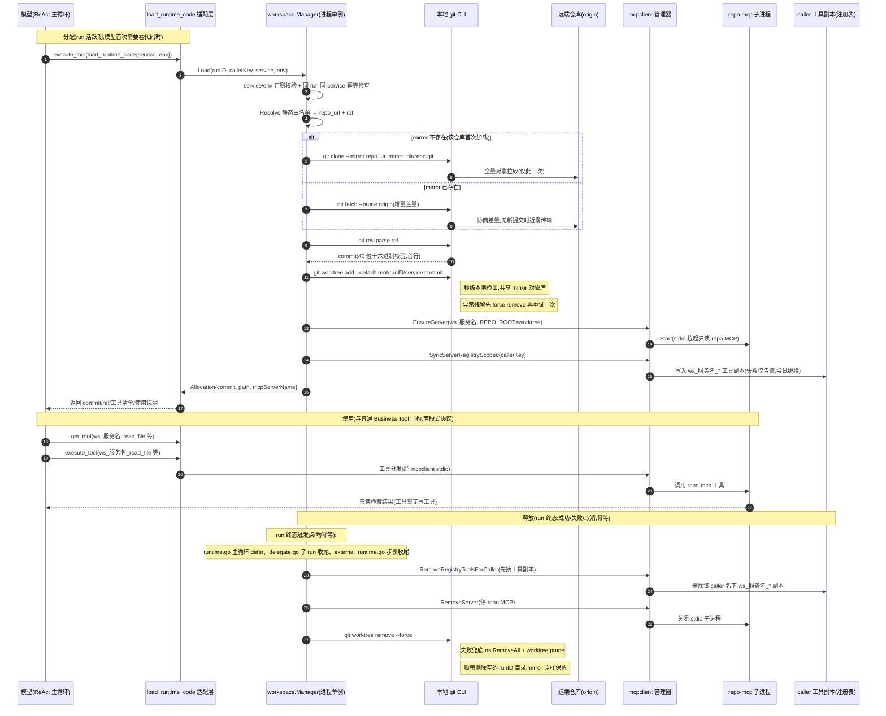

# Workspace 模块功能文档

## 1. 模块概述

Workspace 模块为 ReAct Runtime 提供服务端代码工作区：模型调用 `load_runtime_code` 后，按静态解析表把目标服务代码落到本次 run 专属的 git worktree，并动态挂载只读 repo MCP，产出 `ws_<service>_*` 前缀的代码检索工具。引擎不直接理解文件系统、Git 或仓库协议，代码检索能力以普通 Business Tool 形式经 `get_tool`/`execute_tool` 使用。

模块由三部分组成：`service/workspace` 负责 Git/worktree/MCP 生命周期；`service/react/load_runtime_code.go` 是引擎侧薄适配入口；`/react/workspace/active` 提供只读运行视图。

理解本模块的关键是**两种存储形态**：

| 形态 | 位置 | 生命周期 | 内容 |
|---|---|---|---|
| git 对象形态（bare mirror） | `<mirror_dir>/<repo>.git` | 跨会话持久，不随 run 回收 | zlib 压缩的 commit/tree/blob 对象与打包引用，数据完整但无可浏览文件树 |
| 源码文件形态（worktree） | `<root_dir>/<runID>/<service>` | 不超过单个 run，终态即删 | 检出展开后的可读源码树，与 mirror 共享对象库（不复制 git 数据） |

全量网络拉取（`clone --mirror`）只发生在某仓库第一次被加载时；此后每次分配仅做增量 `fetch --prune`（远端无新提交时近零传输）加本地秒级 worktree 检出。

## 2. 接口清单

| 路径 | 方法 | 功能 | 控制器 |
|---|---|---|---|
| `/react-base-service/react/workspace/active` | POST | 查询当前进程内活跃 worktree 清单 | `react.ListActiveWorkspaces` |

运行期入口是 Meta Tool `load_runtime_code`（`workspace.enabled=true` 时注册，见 `meta_tools.go` 的 `internalMetaToolDefinitions`），不占 HTTP 路由。

## 3. 端到端时序

下图为一次完整生命周期：模型首次需要看代码时触发分配 → 以普通 Business Tool 使用 → run 终态统一释放。父 run、delegate 子 run、external run 的收尾路径均挂了幂等的 `ReleaseRun`。



## 4. 核心逻辑

### 4.1 分配流程（`Manager.Load`）

全程持有 `Manager.mu` 互斥锁，步骤依次为：

1. **门控与校验**：`workspace.enabled` 未开启直接返回参数错误；`service`/`env` 仅允许字母数字下划线中划线（防路径穿越）。
2. **幂等检查**：`active[runID]` 中已存在同 service 的分配则直接返回既有 `Allocation`——同一 run 内模型重复调用 `load_runtime_code` 无额外开销。
3. **Resolve**：查 `workspace.resolvers` 静态白名单，env 命中 `refs` 则用之，否则回退 `default_ref`（空为 HEAD）；service 不在白名单即报错并列出已知服务。
4. **ensureMirror**：以 `<mirror_dir>/<repo>.git` 为稳定映射（repo URL basename 推导，非法名回退 `repo<len>`）。mirror 已存在（`HEAD` 文件存在且非目录）则 `git fetch --prune origin` 增量刷新，否则 `git clone --mirror` 全量克隆。
5. **resolveCommit**：在 mirror 内 `rev-parse` 把 ref 解析为完整 commit，输出取首行并按 40 位十六进制校验——此后 run 内代码**锁定在该 commit**，不受远端后续推送影响。
6. **worktree 分配**：`git worktree add --detach <root_dir>/<runID>/<service> <commit>`（绝对路径，避免相对 mirror 解析）；已存在异常残留时先 `worktree remove --force` 再重试一次。
7. **挂载 repo MCP**：`mcpclient.EnsureServer` 拉起名为 `ws_<service>` 的 stdio repo MCP（`REPO_ROOT` 指向 worktree），失败则回滚删除 worktree；`SyncServerRegistryScoped` 把工具副本同步到该 caller（toolId 带 `__<callerKey>` 后缀），同步失败仅告警、不中断分配。

### 4.2 存储形态与网络语义

- **mirror 是"git 形态"的持久缓存**：目录内只有 `HEAD`/`objects`/`refs`/`packed-refs` 等 git 内部结构，没有可直接浏览的源码文件树；不检出也能经 `git -C <mirror> show`/`log`/`cat-file` 读取内容。数据跨会话、跨 run 保留，是"第二次以后不需要全量拉取"的基础。
- **worktree 是"源码形态"的临时展开**：检出只是把对象库中目标 commit 的 tree 解压成真实文件，不复制 git 数据；多个 run 各持 worktree（即使不同 commit）时磁盘上对象库始终只有 mirror 一份。
- **网络强一致语义**：每次 `Load` 都强制 `fetch --prune`，失败即整体失败（返回"mirror 刷新失败"），**不会降级使用本地既有数据**。这是设计选择：ref → commit 在分配时刻钉死，必须先刷新到最新 ref 才能保证锁定的 commit 是目标环境的"线上版本"。代价是远端不可达（如 SSH 私库 VPN 断开）时 `load_runtime_code` 失败，即便本地 mirror 数据完整。

### 4.3 释放语义与孤儿清理

worktree 生命周期不超过单个 run：run 终态时 `runtime.go` 的 run 收尾 defer、`delegate.go` 的子 run 收尾（同步与 detached 两条路径）、`external_runtime.go` 的步骤收尾均调用 `ReleaseRun`（幂等，重复调用无副作用）。

单个 Allocation 的释放顺序有意**先摘能力再回收目录**，避免释放窗口内模型侧 `get_tool` 仍命中：

1. `RemoveRegistryToolsForCaller` 删除该 caller 名下 `ws_<service>_*` 工具副本；
2. `RemoveServer` 停掉 repo MCP 子进程；
3. `worktree remove --force` 回收 worktree（失败兜底 `os.RemoveAll` + `worktree prune`），顺带删除空的 runID 目录；
4. **mirror 不动**——留给后续 run 复用。

进程重启意味着全部 run 已终态（active 索引丢失），`Default()` 首次调用时 `cleanupOrphans` 直接 `os.RemoveAll` 清空整个 root 目录，下次分配由 `worktree add` 重建。

### 4.4 代码检索作为普通 Business Tool

挂载的 `ws_<service>_*` 工具共 8 个：`list_files`、`read_file`、`search_code`、`search_pattern`、`find_symbol`、`get_file_symbols`、`find_references`、`get_repo_map`，其中符号类工具为 go/ast 声明感知实现，由 `cmd/repo-mcp` 构建的 stdio 适配器提供。这些工具与手工登记的 Business Tool 同构，仍走 `get_tool` 加载 → `execute_tool` 执行两段式协议，受 caller 工具可见性约束；ReAct 主循环无任何 Workspace 特殊执行分支。只读语义由 repo-mcp 工具集保证（无写工具）。

### 4.5 未启用行为、安全约束与已知局限

`workspace.enabled` 未配置默认 false：不注册 `load_runtime_code`（模型不可见），`Load` 返回参数错误"workspace 未启用"，`/react/workspace/active` 恒返回空数组（空列表为正常态）。

安全约束：

- git 子命令白名单仅 `clone`/`fetch`/`worktree`/`rev-parse`；
- ref 字符校验 `^[a-zA-Z0-9._/\-]+$`（拒绝空白与元字符），rev-parse 输出再按 40 位十六进制校验；
- `exec.Command("git")` 为编译期常量、argv 直传不经 shell；
- resolver 为静态白名单，不接收任意仓库地址；路径参数由 `filepath.Join` 生成且各段已校验；
- 单次 git 子操作超时 `git_timeout_sec`（默认 180 秒，配置归一化兜底 `<=0` 取默认值）超时 kill 进程。

已知局限（跨平台一致，非 macOS 特有）：

- **超时 kill 不杀进程组**：`cmd.Process.Kill()` 只对 git 主进程发 SIGKILL，git 传输时 spawn 的 `git-remote-https`/`ssh` 子进程可能短暂残留至网络 IO 自然结束；影响为短暂孤儿进程与可能的对象库锁残留，下次 fetch 重试基本可自愈。
- **无离线降级**：见 4.2,fetch 失败即分配失败。若需支持"离线用缓存"模式，须在 `ensureMirror` 增加 fetch 失败降级 + ref 使用本地已有值的开关。

## 5. 数据模型与文件系统布局

本模块不新增数据表。运行态仅存在于进程内：`Manager.active` 以 runID → `[]*Allocation` 索引；`ActiveSnapshot` 输出值拷贝供管理面展示（runId、service、ref、commit、path、工具前缀、callerKey、loadedAt）。

文件系统布局（默认配置，相对于服务进程工作目录解析）：

```text
data/
├── repo-cache/                  # mirror_dir：bare mirror 单副本缓存（跨会话持久）
│   └── bw-go.git/               #   bare 仓：HEAD/objects/refs/packed-refs，无可浏览源码
└── workspaces/                  # root_dir：run 级 worktree（run 终态即删，进程重启全清）
    └── <runID>/
        └── <service>/           #   展开后的可读源码树，共享 mirror 对象库
```

## 6. 配置项

`llm.react.workspace`（`conf/mount/custom.yaml`）：

| 配置 | 默认值 | 说明 |
|---|---|---|
| `enabled` | false | 总开关，未配置时不注册 `load_runtime_code` |
| `root_dir` | `./data/workspaces` | 每 run worktree 分配根目录 |
| `mirror_dir` | `./data/repo-cache` | bare mirror 缓存目录 |
| `git_timeout_sec` | 180 | 单次 git 子操作超时秒数 |
| `resolvers[]` | 空 | 静态解析表：`service`、`repo_url`、`refs`（env → ref 映射）、`default_ref` |

resolver 配置示例：

```yaml
llm:
  react:
    workspace:
      enabled: true
      root_dir: './data/workspaces'
      mirror_dir: './data/repo-cache'
      git_timeout_sec: 180
      resolvers:
        - service: react-base-service
          repo_url: 'https://git.example.com/server/react-base-service.git'  # https/ssh/file 均可
          default_ref: main          # 缺省 ref，空为 HEAD
          refs:
            prod: main               # env 命中则优先使用
        - service: bw-go
          repo_url: 'git@git.example.com:team/bw-go.git'  # SSH 私库依赖本机 ~/.ssh 密钥
          default_ref: main
```

## 7. 历史版本

| 版本 | 日期 | 修改人 | 变更说明 |
|---|---|---|---|
| v1.1 | 2026-09-29 | react-base-service 项目组 | 补充端到端时序图、两种存储形态（mirror/worktree）与网络语义、文件系统布局、resolver 配置示例、已知局限（超时不杀进程组、fetch 无离线降级） |
| v1.0 | 2026-09-19 | react-base-service 项目组 | 从 main 分支代码建立 Workspace 模块文档基线 |
