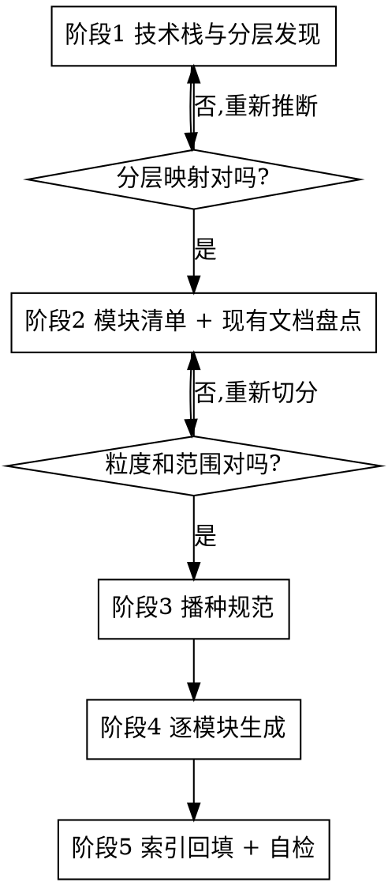

# 项目文档体系初始化

## 概述

为**已完成开发但文档缺失或混乱**的项目扫描代码，产出一套自描述、可持续维护的文档体系。

核心原则：**规范本身也是产物**。除了生成文档，还要在目标仓库写入 `docs/CONVENTION.md`，让后续所有变更（包括其他 Agent 和人）都有唯一权威可依。不要把规范只留在本 skill 里。

## 何时使用 / 何时不用

**使用：**
- 项目代码已成型，但 docs/ 为空、只有一份过时 README、或散落着互相矛盾的文档
- 存在"xxx_v2.md"、"xxx_最终版.md"这类并行文档
- 文档引用的路由、函数、接口已不存在
- 接手他人项目需要建立文档基线

**不用：**
- 单次代码变更后写变更记录 → 用 `writing-changelog`
- 单个接口的 API 文档 → 项目若有 api-doc 类 skill 优先用它

**单模块增量模式：** 项目文档体系已规范，只需补写或重构**某一个**模块的文档时，走精简路径 —— 跳过阶段 1 的用户确认（快速验证分层即可）、跳过阶段 2 的全量模块清单（但仍要盘点该模块的既有文档）、跳过阶段 3 播种规范（已存在），执行阶段 4 生成单篇，阶段 5 只回填索引中的对应一行。

重构**已存在**的模块文档时：保留原"历史版本"表的所有行，在顶部新增一行记录本次重构，`version` 在原版本上递增（原 v1.0 → v1.1；结构性重写可到 v2.0）。**不要**把 version 重置为 v1.0、也不要把新行写成"初始版本" —— 那会抹掉文档自身的演进历史。

## 五阶段流程

分阶段是为了在早期给用户纠偏机会。一个真实项目常有 20+ 模块，全量生成是一次几十文件的巨型输出，中途出错难恢复。



**两个检查点是强制的。** 不要因为"看起来很明显"就跳过阶段 1、2 直接生成文档 —— 模块切分错了，后面几十个文件全要重写。

### 阶段 1：技术栈与分层发现

识别语言与框架，定位五层的**实际**目录。核心抽象：

> 一个模块 = 从路由到数据层的一个业务竖切片，不是一个代码包。

Go/Gin 项目走快路径，直接验证是否存在这套惯例：

| 层 | Go/Gin 典型位置 | 作用 |
|---|---|---|
| 路由 | `router/` | 找模块入口和接口清单 |
| 控制器 | `controllers/http/<模块>/` | 找 Swagger 注释、参数绑定 |
| DTO | `components/params/`、`dto/` | 找请求/响应结构（`*Req`/`*Resp`） |
| 服务 | `service/<模块>/` | 找核心业务逻辑 |
| 数据 | `models/`、`entity/` | 找表结构和字段 |

其他技术栈降级适配：找到等价层即可（如 Spring 的 `@RestController`/`@Service`/`@Entity`，NestJS 的 `*.controller.ts`/`*.service.ts`/`*.entity.ts`，Django 的 `urls.py`/`views.py`/`models.py`）。找不到清晰分层时，以路由/入口文件为锚点反向追踪调用链。

**产出并向用户确认**：分层映射表 + 识别到的框架。

### 阶段 2：模块清单与现有文档盘点

**模块清单** —— 每个模块给出：名称、接口数、涉及文件、建议优先级（按接口数和业务重要性）。

模块名用**业务语义**，不是包路径。`module: chart` 对，`module: service/chart` 错，`module: chart, dataset, report` 错（必须单一模块）。

**现有文档盘点** —— 逐份判定并给出证据：

| 判定 | 依据 | 处理 |
|---|---|---|
| 可复用 | 内容与代码一致 | 按模板重构，保留内容 |
| 已失效 | 引用的路由/函数/接口在代码中不存在 | **列出证据，交用户决定** |
| 重复 | 同主题多份（xxx_v2、xxx_最终版） | 列出，建议合并为一篇 |

**绝不主动删除用户项目里的文档。** 即使规范说"发现过期文档直接删除或合并"，在他人项目上 skill 也只能列清单 + 附证据（如"引用的 `ChartProcessor` 接口已不存在，`/chart/table` 路由已移除"），删不删由用户定。

**产出并向用户确认**：模块清单（含粒度）、待处理文档清单、本次处理范围。

### 阶段 3：播种规范

写入三个文件（**这一步不能省**，否则文档体系无法自我延续）：

1. `docs/CONVENTION.md` —— 复制 `reference/CONVENTION.md`，填入项目实际的模块枚举值、维护人、分层路径
2. `docs/README.md` —— 根索引
3. `scripts/check-docs.sh` —— 复制 `reference/check-docs.sh`，front-matter 校验脚本

第 3 项补上了大多数项目缺失的机器约束。纯靠约定不设校验，front-matter 合规率会随时间衰减。

### 阶段 4：逐模块生成

按 `reference/system-doc-template.md` 的 6 节模板，一次一个模块，写入 `docs/system/<模块名>.md`。

模块之间无共享状态，可派并行 subagent（每个 agent 负责一个模块，都必须收到模板和示例）。

**参考 `reference/system-doc-example.md`** —— 真实范例，展示详细程度应该到什么颗粒度。

### 阶段 5：索引回填与自检

- 更新 `docs/system/README.md`：`| 文档 | 模块 | 版本 | 最近更新 | 说明 |`，版本和日期列必须与各文档 front-matter 一致
- 运行 `bash scripts/check-docs.sh`，贴出真实输出
- 报告未覆盖的模块及原因

校验脚本不存在时（单模块模式下阶段 3 被跳过），至少手工核对新写文档的 9 个字段齐全、`version`/`date` 与索引一致，并说明未做自动校验。不要因为脚本缺失就跳过校验环节。

## front-matter：9 个必填字段

每篇文档顶部必须有，一个不能少，不能自创字段：

```yaml
---
title: <文档标题>
date: YYYY-MM-DD
version: vX.Y
type: system
module: <单一业务模块名>
maintainer: <维护人>
status: active
related_code:
  - router/xxx.go
  - service/xxx/
summary: <一句话概括>
---
```

`related_code` 至少 1 项，这是代码到文档的**唯一**链接机制。YAML 列表项写裸路径，不加反引号（`- router/tree.go`）。**不要**在正文另开一节"相关代码"来列文件 —— 那会与 front-matter 重复且必然不同步。

**列哪些文件**：本模块竖切片自有的文件（路由、控制器、DTO、服务、模型）。跨模块共享的基础设施（中间件、通用工具、helpers）不列，除非该模块是它的主要使用方。宁少勿滥，5-8 条为宜。

**maintainer 填什么**：优先沿用同目录既有文档的多数派取值；无既有文档时用 `git log` 取该模块主要提交者，或填团队名。不要留空或填 `unknown`。

## 模板：哪些能改，哪些不能

| 部分 | 可否调整 |
|---|---|
| front-matter 9 字段 | **固定**，不增不减不改名 |
| §1 模块概述 / §2 接口清单 / §3 核心逻辑 | **固定**，必有且不改名 |
| §4 数据模型 / §5 配置项 | 可按模块特点改名（如"配置项与限制"）或在确实不适用时省略 |
| 中间插入模块特有章节 | 可以（如"测试"、"运维"） |
| 末节"历史版本" | **固定**，始终是最后一节，编号随前面章节数浮动 |
| 表格增列 | 可以（如接口清单加"中间件"列） |

## 描述行为，不做评价

扫代码时必然会发现代码问题（O(n²) 排序、硬编码白名单、空函数占位、软删语义不统一）。界限：

- ✅ **陈述行为**："排序实现为冒泡交换，非稳定排序"、"白名单硬编码在 `middleware/auth.go`，修改需重新发布"、"`ListForMySpace` 为空实现，尚未落地"
- ✅ **记录当前实现的局限**："本阶段尚未直接消费 `include/exclude`"、"列表接口无分页，一次返回全部"
- ❌ **给出改进建议**："应改为 `sort.SliceStable`"、"建议抽成配置项"、"这里存在性能隐患"

读者需要知道系统**现在是什么样**（含不完美之处），但模块文档不是 issue 列表 —— 改进建议会很快过时，且让文档失去中立性。

发现值得修的问题，在**回复用户时**单独列出，不写进文档。

## 写作风格

从真实项目提炼，照此执行：

- **中文正文**；代码标识符、路径、HTTP 路由、引擎名保持原文
- **陈述句、现在时、无人称**。不用"我们"，不加对仗和修辞
- **每个标识符、路径、字段名加反引号**
- **表格优先**：接口清单、历史版本、字段说明、对比矩阵
- **显式记录否定事实**：如"本模块不新增数据表"、"无新增 YAML 配置" —— 读者需要知道"确实没有"而不是"作者忘了写"
- **具体到可验证**：真实限制数值（树层级最多 10 级、单次最多 100000 行）、真实函数名。不写"性能较好"这类无法验证的话
- **`file.go:line` 行号引用要少用** —— 行号会漂移，路径足够

## 常见错误

| 错误 | 后果 | 正确做法 |
|---|---|---|
| 不写 front-matter | 文档无法被索引、校验、追溯 | 9 个字段全写 |
| 改动模板的固定部分 | 各模块文档无法对比阅读 | 见下方"哪些能改，哪些不能" |
| 正文开"相关代码"节列文件 | 与 `related_code` 重复且会不同步 | 只写在 front-matter |
| 混入代码评审意见 | 模块文档变成 issue 列表，很快过时 | 只描述当前行为；代码问题单独反馈给用户 |
| `module` 填包路径或逗号列表 | 无法按模块聚合、无法触发整合 | 单一业务模块名 |
| 缺"历史版本"表 | 无法追溯演进，整合时无处记录 | 始终作为最后一节，倒序 |
| 跳过检查点直接全量生成 | 模块切错则几十文件重写 | 阶段 1、2 后各确认一次 |
| 主动删除用户的旧文档 | 可能删掉唯一的业务知识来源 | 列证据，交用户决定 |
| 一个模块拆多篇平行文档 | 出现 xxx_v2、职责重叠 | 一模块一主文档；必须拆分时在主文档加索引并写明职责边界 |

## 参考文件

- `reference/CONVENTION.md` —— 规范模板，播种到目标仓库
- `reference/system-doc-template.md` —— 6 节骨架
- `reference/system-doc-example.md` —— 真实范例（看结构和颗粒度，别抄业务内容）
- `reference/check-docs.sh` —— front-matter 校验脚本