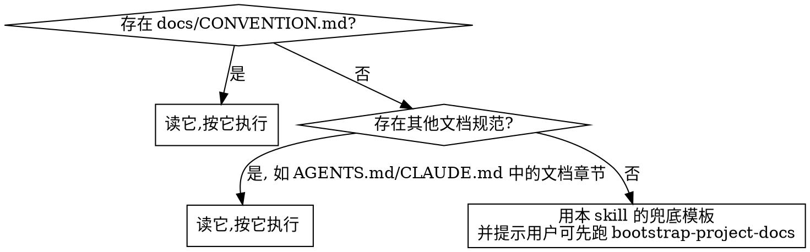

# 变更记录与整合

## 概述

两件事：**为一次代码变更写变更记录**，以及**当同模块变更记录累积过多时整合进系统文档**。

核心原则：**目标仓库的 `docs/CONVENTION.md` 是唯一真相源**。先读它，按它执行。本 skill 的模板只在目标仓库没有规范时兜底。

## 何时使用 / 何时不用

**使用：**
- 刚改完代码，需要留下变更记录
- 用户说"合并/整合某模块的 changelog"
- 写完变更记录后发现同模块 active 文档已超阈值

**不用：**
- 项目文档整体缺失或混乱，需要从零建体系 → 用 `bootstrap-project-docs`
- 只是要写 git commit message → 直接写，不需要文档

## 第一步：读规范（不可跳过）



同时看一眼 `docs/changelog/` 里最近的 2-3 篇实际文档 —— 规范和实践常有偏差。

**规范与实践冲突时的判定**：
- 结构性要求（字段是否必填、章节编号、命名格式）→ **以规范为准**
- 风格性选择（详细程度、表格 vs 列表、是否配图）→ **以实践为准**
- 冲突明显且影响面大时 → 按规范执行，并在回复里向用户指出这处偏差

例：规范要求 `related_code` 含被更新的文档本身，但既有文档普遍不含 —— 这是结构性要求，按规范写上，并告知用户既有文档与规范不一致。

## 流程 A：写变更记录

### A1. 收集变更事实

- `git diff`（未提交）或 `git show <commit>`（已提交）拿到实际改动
- 确定受影响的**业务模块**（单一模块名，不是包路径）
- 确定改动性质：修复 / 新增 / 优化

### A2. 命名与版本号

`docs/changelog/YYYYMMDD_vX.Y_<主题说明>.md`

- 日期 = 变更实施日期
- **版本号 = 这篇文档自身的版本，新建即 `v1.0`**
- 主题：修复类以「修复」开头，新增类以「新增」开头，其他用名词短语

⚠️ **版本号最容易错**：不要去看系统文档是 v1.8 就写 v1.8，也不要跟随项目发布版本。绝大多数新建文档都是 **v1.0**。

只有**同一主题的续作**才递增（`v1.0` → `v1.1`）。「同一主题」的判据是**修改同一处行为**，不是"相关"或"同模块"：

| 关系 | 版本号 |
|---|---|
| 修正/延续前一篇改动的**同一处行为** | 递增（v1.0 → v1.1） |
| 同模块但改的是**另一处行为** | 新的 v1.0 |
| 同一功能域但目标不同 | 新的 v1.0 |

例：「树形筛选稳定排序」v1.1 是因为它继续调整 v1.0 引入的同一段建树排序逻辑。而「SQL 模型导出列顺序」与「数据模型导出支持超级表头」虽同属导出功能，改的是不同链路，各自 v1.0。

拿不准时选 v1.0 —— 误判为新主题的代价，远小于把不相关的文档串成假的修订链。

### A3. 写 front-matter

9 个字段全填，`type: changelog`，`status: active`。

`related_code` 列出本次**实际改动的文件**，包括测试文件和被更新的文档本身 —— 文档是变更的交付物之一。

### A4. 按模板写正文

见 `reference/changelog-template.md`。功能类参考 `reference/changelog-example.md`，修复类参考 `reference/bugfix-example.md`。

关键要求：

| 章节 | 要求 |
|---|---|
| §1 背景与目标 | 说清**为什么**要改。修复类展开 `### 问题描述` / `### 根因分析` / `### 影响范围` |
| §2 代码改动 | 按文件组织，每个文件下写改动说明。不贴大段 diff |
| §3 影响范围 | 接口、模块、配置逐项写。**没有影响也要写明**（"不新增数据表、配置项或缓存"） |
| §4 测试验证 | **真实执行过的命令 + 结论**。不写"已测试通过"这种无凭据的话 |
| §5 风险与兼容性 | 写用户可感知的后果。真的无风险才写无风险 |
| §6 历史版本 | 始终最后一节 |

### A5. 同步系统文档

若本次是功能变更，同步更新 `docs/system/<模块>.md` 的相关章节和"历史版本"表。

**同步后 changelog 的 status 仍保持 `active`。** `merged` 只表示"已经过一次整合复核"，不是"内容已同步"。两者区别：A5 同步的是本次的事实增量，保证系统文档即时准确；整合是回过头复核整个模块、消除重复与矛盾的批量动作。

### A6. 检查是否该整合

数一下同模块 active 文档数：

```bash
grep -l "^module: <模块名>" docs/changelog/*.md | xargs grep -l "^status: active" | wc -l
```

超过规范阈值（默认 5）时，**告知用户并询问是否现在整合**：

> `chart` 模块已累积 7 篇 active 变更文档，超过整合阈值 5。是否现在整合进 `docs/system/chart.md`？

**不要自动开始整合。** 用户可能正赶进度，不希望一次小改动连带修改十几个文件。等确认。

**远超阈值时（如已积压 30 篇）**：说明该项目长期未执行整合，阈值提醒已失去意义。此时不要每次写完 changelog 都重复追问 —— 在本次回复末尾用一句话说明积压情况并建议安排一次专项整合，然后继续。反复追问只会让用户忽略这个提醒。

## 流程 B：整合

### B1. 圈定范围

```bash
grep -l "^module: <模块名>" docs/changelog/*.md | xargs grep -l "^status: active"
```

按 `module` 字段圈定，**不要按文件名关键词**。文件名含某关键词但 `module` 是别的模块的，不属于本次范围。

**先实际执行 grep 数出真实篇数**，不要沿用任何文档里的示例数字。

**遇到规范外的 status**（`draft`、`pending`、`dev` 等实践中产生的值）：默认**不纳入**整合范围，但要在报告里列出来问用户 —— 这些文档可能是未完成的草稿，也可能是写了 active 之外的值但实际已生效。不要静默忽略。

**运维手册类文档不整合。** 判据：文档的价值在于**可照着执行的操作步骤**（备份/替换/回滚命令序列、故障处置流程），而非记录某次代码改动。这类文档保持 `active`，在系统文档相应位置加链接指向它。摘要化会摧毁其价值。注意区分：含 SQL/命令示例但主体是描述一次代码变更的，仍属正常 changelog，要整合。

先读 `docs/system/<模块>.md`，判断哪些 changelog 的内容其实**已经**被吸收过 —— 整合往往是"补完未吸收的部分"，不是把 N 篇文档拼起来。已吸收的仍要改 status，只是不必再改系统文档。

### B2. 合并进系统文档

事实性内容（新接口、新字段、配置、行为变更）**融进系统文档对应章节**：新接口进"接口清单"，行为规则进"核心逻辑"，字段进"数据模型"。

**不要**在系统文档尾部追加一节"历史变更"来堆放 changelog 内容 —— 系统文档描述"现在是什么样"，不是变更史。

递增系统文档 `version`，更新 `date`，在"历史版本"表加一行记录本次整合。

### B3. 逐个把原文件改成 merged

对范围内每一篇 changelog，把 front-matter 的 `status: active` 改为 `status: merged`。

这一步在实践中最常被跳过，导致索引与文档实际状态长期不一致、下次整合无法判断范围。**逐个文件都要改。**

### B4. 回填索引

若存在 `docs/changelog/README.md` 或 `docs/system/README.md`，同步更新其中的状态、版本、最近更新列。

## 绝对禁止：删除或合并原始 changelog 文件

整合 = **内容进系统文档 + 原文件改 status**。原文件**永远保留**。

**没有例外：**
- 不删除原文件
- 不把 N 篇合并成一篇"变更合集"再删掉原文件
- 不创建 `20260616-20260902_v1.0_xxx合集.md` 这种日期区间文件
- 不用"git 历史保留了"作为删除理由
- 不用"索引表映射了原文件名所以找得到"作为删除理由
- 不因为"文件太多很乱"就删除

**为什么**：changelog 记录的是**决策过程和根因** —— 某次事故的 requestId、为什么放弃了 MySQL 方案、某个口径调整了三次的原因。系统文档只保留最终状态，这些过程信息一旦删除就永久丢失。git 历史里的删除文件在实践中不会有人去翻，等同于丢失。

**违反的信号 —— 出现这些念头就停下：**

| 念头 | 现实 |
|---|---|
| "git 历史保留了，删了也能找回" | 没人会去 git 历史翻已删文档。等同于丢失 |
| "我做了索引表映射，不会找不到" | 索引指向的是已删除的文件，映射到空 |
| "21 篇太多了，目录很乱" | 乱不是删除的理由。改 status 后可按状态过滤 |
| "内容已经并进系统文档了，原文冗余" | 系统文档只留最终状态，丢了根因和决策过程 |
| "合并成一篇合集更清晰" | 合集是新增，不是替代。原文仍要保留 |
| "用户说'整合一下'就是让我清理" | 整合 ≠ 删除。不确定就问用户 |

用户**明确要求**删除时，先说明会丢失什么，确认后再删。

## 常见错误

| 错误 | 后果 | 正确做法 |
|---|---|---|
| 不读目标仓的 CONVENTION.md | 格式与项目现有文档不一致 | 第一步就读 |
| 自创 front-matter 字段（`commit:`、`author:`） | 校验失败，索引工具无法解析 | 只用规范定义的 9 个字段 |
| 漏填 front-matter 字段 | 同上 | 9 个全填 |
| 版本号跟随系统文档或发布版本 | 版本号语义错乱，无法追溯修订链 | 新建 v1.0；同主题修订才递增 |
| 用「一、二、三」编号 | 与项目其他文档不一致 | `## 1.` 阿拉伯数字 |
| 改写章节名 | 无法按章节聚合和对比 | 用模板原章节名 |
| §4 写"已测试通过" | 无凭据，无法复核 | 贴真实命令和结论 |
| §3 空着或写"无影响" | 读者无法判断是否波及自己 | 逐项写明，含否定事实 |
| 整合时删除原文件 | 根因和决策过程永久丢失 | 只改 status |
| 整合时按文件名关键词圈定范围 | 误把其他模块的文档卷进来 | 按 `module` 字段 |
| 整合后忘记改 status | 下次整合无法判断范围 | 逐个文件改 |
| 在系统文档追加"历史变更"节 | 系统文档变成变更史，失去"当前状态"语义 | 融进对应章节 |
| 达到阈值就自动整合 | 一次小改动连带修改十几个文件 | 先问用户 |

## 参考文件

- `reference/changelog-template.md` —— 6 节骨架
- `reference/changelog-example.md` —— 真实范例：功能/优化类变更
- `reference/bugfix-example.md` —— 真实范例：修复类变更
- `reference/consolidation.md` —— 整合流程详解与合并前后对照